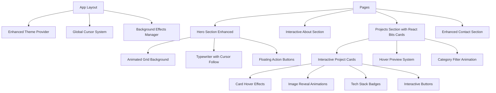
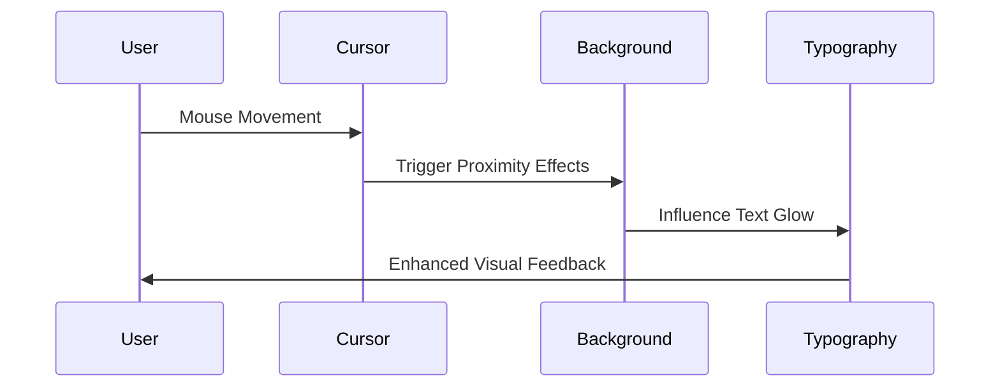
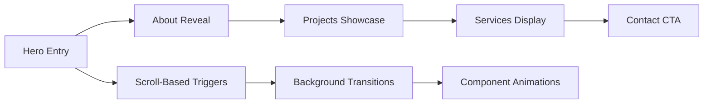
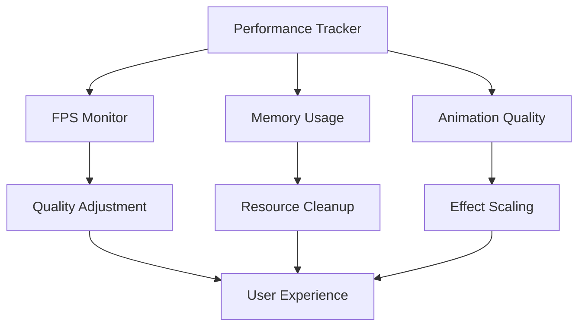

# UI Revamp Using React Bits - Design Document

## Overview

This design outlines a comprehensive visual and UI revamp for the animated portfolio website, leveraging React Bits components, patterns, and design philosophy. The goal is to create a more refined, interactive, and visually stunning experience while maintaining the existing content and data structure.

### Design Goals
- Implement React Bits-inspired animations and interactions
- Create highly interactive project cards with advanced hover effects
- Integrate sophisticated background patterns and cursor animations
- Enhance visual hierarchy with refined typography and spacing
- Maintain responsive design and accessibility standards

### Design Philosophy
- **Minimal but Impactful**: Clean layouts with purposeful animations
- **Interactive Excellence**: Every element should respond to user interaction
- **Performance-First**: Smooth 60fps animations with optimized rendering
- **Cohesive Experience**: Consistent animation language across all components

---

## Technology Stack & Dependencies

### Core Framework
- **Next.js 15** with App Router (Need to upgrade to 15)
- **TypeScript** for type safety (maintained)
- **Tailwind CSS** with enhanced custom utilities
- **Framer Motion** for advanced animations

### New Animation Libraries
- **React Bits Components** (selective integration)
- **@react-spring/web** for physics-based animations
- **react-intersection-observer** for enhanced scroll triggers
- **react-use-gesture** for gesture-based interactions

### Enhanced UI Components
- **Radix UI** (maintained as base)
- **Lucide React** icons (maintained)
- **Custom cursor components** inspired by React Bits
- **Advanced card hover systems**

---

## Component Architecture

### Enhanced Component Hierarchy



### Key Component Enhancements

#### 1. Global Cursor System
```typescript
interface CursorConfig {
  variant: 'default' | 'pointer' | 'text' | 'splash' | 'magnetic'
  size: 'sm' | 'md' | 'lg'
  color: string
  trailEnabled: boolean
}
```

#### 2. Interactive Project Cards
```typescript
interface ProjectCardProps {
  project: Project
  hoverEffect: 'tilt' | 'lift' | 'glow' | 'parallax'
  imageReveal: 'slide' | 'zoom' | 'blur' | 'morph'
  interaction: 'magnetic' | 'cursor-follow' | 'ripple'
}
```

#### 3. Background Effect Manager
```typescript
interface BackgroundEffect {
  type: 'grid-motion' | 'dot-pattern' | 'gradient-mesh' | 'particles'
  intensity: 'subtle' | 'medium' | 'high'
  responsiveToMouse: boolean
  scrollParallax: boolean
}
```

---

## Detailed Design Specifications

### 1. Enhanced Hero Section

#### Visual Elements
- **Animated Grid Background**: Responsive dot/line pattern that reacts to mouse movement
- **Gradient Mesh Overlay**: Dynamic color shifting with smooth transitions
- **Magnetic Cursor**: Cursor attraction to interactive elements
- **Floating Particles**: Subtle particle system with physics-based movement

#### Interaction Design
- **Typewriter Enhancement**: Cursor follows text with trailing effects
- **Button Interactions**: Magnetic hover with ripple effects
- **Scroll Indicator**: Animated chevron with bounce and glow
- **Background Response**: Grid lines pulse on mouse proximity

#### Animation Specifications


### 2. Interactive Project Cards System

#### Card Design Architecture
- **Three-Layer Structure**: Background, Content, Interactive Overlay
- **Hover State Machine**: Idle → Hover → Active → Exit states
- **Performance Optimization**: GPU-accelerated transforms
- **Accessibility**: Keyboard navigation with visual feedback

#### Interaction Patterns

##### Hover Effects (Inspired by React Bits)
1. **Tilt Animation**: 3D perspective transformation
2. **Glow Effect**: Dynamic border and shadow animation
3. **Image Reveal**: Progressive image unveiling on hover
4. **Content Slide**: Smooth content area transformations
5. **Magnetic Attraction**: Cursor-following elements

##### Click Interactions
1. **Ripple Effect**: Click origin expansion animation
2. **Content Expansion**: Modal-style content preview
3. **Route Transition**: Smooth page navigation
4. **State Persistence**: Remember interaction preferences

#### Technical Implementation
```typescript
interface CardAnimationStates {
  idle: {
    transform: 'translate3d(0,0,0) rotateX(0) rotateY(0)'
    boxShadow: 'initial'
    borderGlow: 'none'
  }
  hover: {
    transform: 'translate3d(0,-8px,0) rotateX(5deg) rotateY(2deg)'
    boxShadow: '0 20px 40px rgba(0,0,0,0.1)'
    borderGlow: 'active'
  }
  active: {
    transform: 'scale(0.98)'
    transition: 'transform 0.1s'
  }
}
```

### 3. Background System Enhancement

#### Dynamic Background Patterns
- **Grid Motion**: Animated grid that responds to scroll and mouse
- **Dot Matrix**: Pulsing dot pattern with wave propagation
- **Gradient Mesh**: Fluid color gradients with perlin noise
- **Particle System**: Physics-based floating elements

#### Responsive Behavior
- **Scroll Parallax**: Background elements move at different speeds
- **Mouse Interaction**: Proximity-based animations
- **Performance Scaling**: Automatic quality adjustment
- **Dark/Light Adaptation**: Theme-aware color transitions

### 4. Enhanced Typography System

#### Text Animation Components
- **Split Text Animation**: Character-by-character reveals
- **Gradient Text Effects**: Animated color transitions
- **Typewriter Enhancement**: Realistic typing with cursor
- **Text Morphing**: Smooth transitions between different texts

#### Accessibility Considerations
- **Reduced Motion Support**: Alternative animations for sensitive users
- **High Contrast Mode**: Enhanced visibility options
- **Screen Reader Compatibility**: Proper ARIA labels for animations

---

## Page-Specific Enhancements

### Home Page Redesign

#### Section Flow and Animations


#### Hero Section Enhancements
- **Magnetic Elements**: Buttons and links attract cursor
- **Background Interaction**: Grid responds to mouse movement
- **Typing Animation**: Enhanced typewriter with realistic cursor
- **Scroll Indicator**: Animated chevron with physics-based bounce

#### About Section Transformation
- **Timeline Animation**: Progressive reveal with line drawing
- **Skill Badges**: Interactive hover states with glow effects
- **Image Interactions**: Parallax and hover transformations
- **Text Reveals**: Staggered paragraph animations

### Projects Page Overhaul

#### Filter System Enhancement
- **Animated Transitions**: Smooth category switching
- **Filter Badges**: Interactive selection indicators
- **Search Animation**: Real-time filter feedback
- **Count Animations**: Numerical updates with spring physics

#### Project Grid System
- **Masonry Layout**: Dynamic grid with smart positioning
- **Infinite Scroll**: Progressive loading with animations
- **Card Interactions**: Multiple hover states and effects
- **Preview System**: Quick view without navigation

#### Individual Project Cards
- **Image Reveal System**: Multiple animation patterns
- **Technology Badges**: Interactive and informative
- **Action Buttons**: Magnetic hover with ripple effects
- **Progress Indicators**: Visual loading states

### Contact Page Enhancement

#### Form Interactions
- **Field Focus States**: Subtle animations and highlights
- **Validation Feedback**: Real-time visual indicators
- **Submit Animation**: Progressive loading states
- **Success States**: Celebration micro-interactions

#### Contact Information Display
- **Icon Animations**: Hover states with personality
- **Social Links**: Magnetic hover effects
- **Contact Methods**: Interactive cards with actions

---

## Animation Performance Strategy

### Optimization Techniques

#### GPU Acceleration
- Transform3d usage for hardware acceleration
- Will-change property management
- Layer promotion strategies
- Composite layer optimization

#### Frame Rate Management
- 60fps target for all animations
- RequestAnimationFrame scheduling
- Intersection Observer for performance
- Automatic quality scaling

#### Memory Management
- Animation cleanup on unmount
- Event listener management
- Resource pooling for effects
- Garbage collection optimization

### Performance Monitoring


---

## Implementation Phases

### Phase 1: Foundation (Week 1)
- Set up React Bits integration
- Implement global cursor system
- Create enhanced theme provider
- Establish animation base components

### Phase 2: Core Components (Week 2)
- Redesign hero section with animations
- Implement interactive project cards
- Create background effect system
- Enhance typography components

### Phase 3: Page Integration (Week 3)
- Update all page layouts
- Implement scroll-based animations
- Add form enhancements
- Create transition systems

### Phase 4: Polish & Optimization (Week 4)
- Performance optimization
- Accessibility improvements
- Cross-browser testing
- Mobile responsiveness refinement

---

## Testing Strategy

### Visual Regression Testing
- Screenshot comparisons for consistency
- Animation behavior verification
- Cross-browser compatibility
- Mobile device testing

### Performance Testing
- Frame rate monitoring
- Memory usage tracking
- Load time optimization
- Interaction responsiveness

### Accessibility Testing
- Screen reader compatibility
- Keyboard navigation
- Color contrast verification
- Motion sensitivity options

### User Experience Testing
- Interaction flow validation
- Animation timing feedback
- Visual hierarchy assessment
- Mobile usability evaluation


