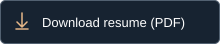

# Adnan Baig — A Working Collection

Personal portfolio for [Adnan Baig](https://github.com/CodnanBaig): a full-stack developer with a frontend foundation, building web applications, developer tools, and mobile-first products.

Built with Next.js 15, React 19, TypeScript, GSAP, and custom CSS. Visual direction and motion rules are documented in `DESIGN.md`.

**Repo:** [github.com/CodnanBaig/animated-portfolio](https://github.com/CodnanBaig/animated-portfolio)

<a href="https://adnanbaigportfolio.netlify.app/Adnan_Baig_Resume.pdf" download="Adnan_Baig_Resume.pdf"></a>

[Download PDF](https://adnanbaigportfolio.netlify.app/Adnan_Baig_Resume.pdf) · [View in repository](public/Adnan_Baig_Resume.pdf) · [Squoosh.AI application PDF](https://adnanbaigportfolio.netlify.app/Adnan_Baig_Squoosh_AI_Resume.pdf)

## Highlights

- A direct introduction with work and contact links
- Scroll-linked parallax and a stacked reel for three flagship projects
- An expandable index for four additional projects
- Seven case-study routes under `/work/[slug]`
- Real screenshots with intrinsic proportions and keyboard-accessible image dialogs
- GitHub links for every project and deployment links where available
- Reduced-motion support and a persistent motion switch
- SEO metadata, Open Graph image, sitemap, robots, and web manifest

## Tech stack

| Layer | Choice |
| --- | --- |
| Framework | Next.js 15 (App Router) |
| Language | TypeScript |
| UI | React 19 + custom CSS |
| Interaction | GSAP ScrollTrigger + native dialogs |
| Typography | Self-hosted Geologica variable font |
| Package manager | pnpm |
| Data | `data/portfolio.ts` |

## Project structure

```
adnan-portfolio/
├── app/                  # App Router pages, layout, SEO, API
│   ├── api/github/       # GitHub profile + repos feed
│   ├── work/[slug]/     # Case study pages
│   ├── layout.tsx
│   ├── page.tsx
│   └── globals.css
├── components/           # Hero, project reel, image viewers, shared navigation
├── data/portfolio.ts     # Profile, projects, experience content
└── package.json
```

## Getting started

### Prerequisites

- Node.js 18+
- [pnpm](https://pnpm.io/)

### Install and run

```bash
pnpm install
pnpm dev
```

Open [http://localhost:3000](http://localhost:3000).

### Production

```bash
pnpm typecheck
pnpm build
pnpm start
```

Deploy to Vercel, Netlify’s Next.js runtime, or any Node host.

## Configuration

Edit project and profile content in `data/portfolio.ts`. Homepage framing lives in `components/portfolio-shell.tsx`. Screenshot provenance is recorded in `public/projects/SOURCES.md`.

Vercel builds use `VERCEL_PROJECT_PRODUCTION_URL` for canonical metadata and the sitemap. To override it, or deploy on another host, set:

```bash
NEXT_PUBLIC_SITE_URL=https://your-domain.com
```

The GitHub route uses the public GitHub API and defaults to `CodnanBaig`. Optional token for higher rate limits:

```bash
GITHUB_TOKEN=github_pat_...
```

## Scripts

| Command | Description |
| --- | --- |
| `pnpm dev` | Dev server (Turbopack) |
| `pnpm build` | Production build |
| `pnpm start` | Serve production build |
| `pnpm typecheck` | TypeScript check |

## Content note

Private repositories are labelled explicitly. PitchGenie's deployed URL is an earlier release; the screenshot shows the current workspace. SignalForge runs locally and dev-clean is a CLI, so neither has an invented deployment link.

## Resume

The one-page resume lives at `public/Adnan_Baig_Resume.pdf`, with editable content in `data/resume.json`. The homepage and footer retain their existing direct-download URL.

The active resume is tailored for **Squoosh.AI — Full-Stack Software Engineer, AI Product & Browser Automation**. It leads with ReproLab, then Don't Go Broke and SignalForge, and retains a concise Mart Fight entry about school and friendship. Python/FastAPI is described as project experience; simulated trading and regression-test drafts are not presented as live trading or automatically proven fixes. No employment title, dates or education credentials were changed.

`public/Adnan_Baig_Squoosh_AI_Resume.pdf` is an identical, application-specific download. The previous general-purpose source is preserved unchanged in `data/resume.general.json` and Git history. The seven website case studies and their ordering are unchanged.

To regenerate with Python 3 and ReportLab:

```bash
python3 -m pip install reportlab==4.4.9
python3 scripts/build-resume.py
```

The builder writes a review copy to `output/pdf/`, the served copy to `public/`, and the optional PDF basename in `downloadFilename`. It rejects page overflow and uses deterministic PDF metadata. Review the rendered PDF before publishing changes.

For offline content, hyperlink, single-page and reproducibility checks:

```bash
python3 -m pip install pypdf
python3 scripts/test-resume.py
```

These checks do not certify public URL availability, application functionality or applicant-tracking-system parsing. The application note and tailoring rationale are in `docs/SQUOOSH_APPLICATION.md`. Review variant-specific test expectations whenever deliberately retargeting the resume.
